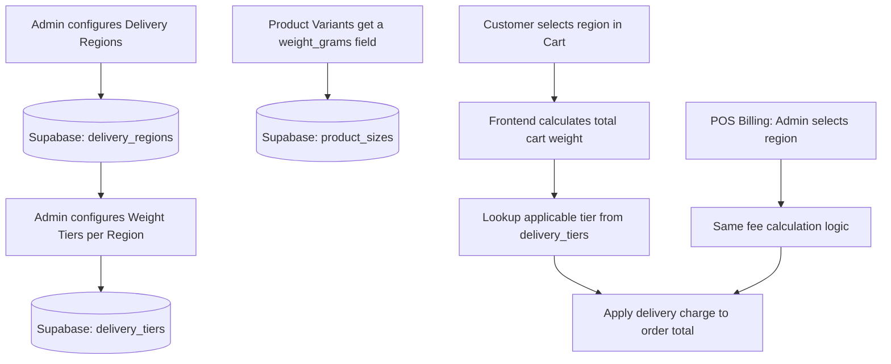

# Implementation Plan: Weight-Based Delivery Fee System

## Overview
A fully configurable, weight-based delivery fee system for Mishi Pooja Products. Admins define regions and weight-tier charges in the dashboard. The cart and POS billing then automatically calculate the correct delivery fee based on the customer's region and total cart weight.

---

## Architecture Summary



---

## Phase 1: Database Schema Changes

Run the following SQL in your **Supabase SQL Editor**.

### 1.1 — Add `weight_grams` to `product_sizes`

```sql
-- Add weight (in grams) to each product size variant
ALTER TABLE product_sizes
ADD COLUMN IF NOT EXISTS weight_grams INTEGER NOT NULL DEFAULT 0;
```

### 1.2 — Create `delivery_regions` table

```sql
-- Stores named delivery regions (e.g. "Tamil Nadu", "Kerala", "Pan India")
CREATE TABLE IF NOT EXISTS delivery_regions (
  id UUID DEFAULT gen_random_uuid() PRIMARY KEY,
  name TEXT NOT NULL UNIQUE,
  is_active BOOLEAN NOT NULL DEFAULT TRUE,
  created_at TIMESTAMPTZ NOT NULL DEFAULT NOW()
);
```

### 1.3 — Create `delivery_tiers` table

```sql
-- Stores the weight-range => charge mapping for each region
-- e.g. Tamil Nadu: 0-10000g => ₹100, 10000-30000g => ₹250
CREATE TABLE IF NOT EXISTS delivery_tiers (
  id UUID DEFAULT gen_random_uuid() PRIMARY KEY,
  region_id UUID NOT NULL REFERENCES delivery_regions(id) ON DELETE CASCADE,
  min_weight_grams INTEGER NOT NULL, -- inclusive lower bound
  max_weight_grams INTEGER NOT NULL, -- exclusive upper bound (NULL = no cap)
  charge INTEGER NOT NULL,           -- delivery fee in rupees
  created_at TIMESTAMPTZ NOT NULL DEFAULT NOW()
);
```

### 1.4 — RLS Policies (to be added to `supabase_rls_policies.sql`)

```sql
-- Allow anyone to read active regions/tiers (needed for storefront cart)
CREATE POLICY "Anyone can read active regions" ON delivery_regions
  FOR SELECT USING (is_active = TRUE);

CREATE POLICY "Anyone can read delivery tiers" ON delivery_tiers
  FOR SELECT USING (TRUE);

-- Allow admins to manage regions and tiers
CREATE POLICY "Admins can manage regions" ON delivery_regions
  FOR ALL USING (public.is_admin());

CREATE POLICY "Admins can manage tiers" ON delivery_tiers
  FOR ALL USING (public.is_admin());
```

---

## Phase 2: TypeScript Interfaces & DB Functions (`lib/db.ts`)

### 2.1 — New Interfaces

```typescript
export interface DeliveryRegion {
  id: string;
  name: string;
  isActive: boolean;
  tiers: DeliveryTier[];
}

export interface DeliveryTier {
  id: string;
  regionId: string;
  minWeightGrams: number;
  maxWeightGrams: number | null; // null = no cap
  charge: number;
}
```

### 2.2 — New `ProductSize` field

```typescript
export interface ProductSize {
  size: string;
  price: number;
  isAvailable?: boolean;
  weightGrams?: number;  // ← ADD THIS
}
```

### 2.3 — New DB functions to add

```typescript
// Fetch all active delivery regions with their tiers
export const fetchDeliveryRegions = async (): Promise<DeliveryRegion[]>

// Upsert a region
export const upsertDeliveryRegion = async (region: Omit<DeliveryRegion, 'tiers'>): Promise<void>

// Delete a region (cascades tiers)
export const deleteDeliveryRegion = async (id: string): Promise<void>

// Replace all tiers for a region
export const setDeliveryTiers = async (regionId: string, tiers: Omit<DeliveryTier, 'id' | 'regionId'>[]): Promise<void>

// Utility: Calculate fee
export const calculateDeliveryFee = (
  totalWeightGrams: number,
  region: DeliveryRegion
): number
```

---

## Phase 3: Admin Delivery Settings Page

**New route:** `/admin/delivery`

### UI Components

| Component | Description |
|---|---|
| `RegionList` | Lists all configured regions with edit/delete actions |
| `RegionForm` | Modal to create/edit a region name |
| `TierEditor` | Inline table to add/remove weight tiers per region |
| `TierRow` | Single row: Min Weight → Max Weight → Charge |

### Admin Page Layout (wireframe concept)

```
┌──────────────────────────────────────────────────────────┐
│  Delivery Fee Settings          [+ Add Region]           │
├──────────────────────────────────────────────────────────┤
│  ▼ Tamil Nadu                                [✎] [🗑]    │
│  ┌────────────┬─────────────┬──────────┐                 │
│  │ Min (g)    │ Max (g)     │ Charge ₹ │                 │
│  ├────────────┼─────────────┼──────────┤                 │
│  │ 0          │ 10,000      │ 100      │                 │
│  │ 10,001     │ 30,000      │ 250      │                 │
│  │ 30,001     │ —           │ 500      │                 │
│  └────────────┴─────────────┴──────────┘                 │
│                               [+ Add Tier] [Save Tiers]  │
├──────────────────────────────────────────────────────────┤
│  ▶ Kerala                                   [✎] [🗑]    │
└──────────────────────────────────────────────────────────┘
```

### Navigation Update
Add "Delivery" to the admin sidebar in `app/admin/ClientLayout.tsx`.

---

## Phase 4: Product Admin — Weight Field

**File to modify:** `app/admin/products/` (product form)

### Changes
- Add a `Weight (grams)` number input field for **each size variant** in the product editor.
- Update `upsertProduct` in `lib/db.ts` to read/write `weight_grams` when upserting `product_sizes`.
- Display weight in the product listing table.

---

## Phase 5: Cart & Checkout Integration

**File to modify:** `app/cart/page.tsx`

### Changes

1. **Fetch delivery regions** on page load.
2. **Add a Region Selector** dropdown in the checkout form (below Address field).
3. **Calculate total cart weight** from selected size variants × quantity.
4. **Auto-calculate delivery charge** reactively whenever cart items or region change.
5. Display the breakdown: Subtotal → Coupon Discount → Delivery Fee → **Grand Total**.
6. Pass the final `deliveryCharge` into the `insertWhatsappRequest` payload.

```
Cart Weight Calculation:
  totalWeight = sum(item.quantity × item.variant.weightGrams)

Fee Lookup:
  applicable tier = first tier in selected region where
    tier.minWeightGrams <= totalWeight < tier.maxWeightGrams (or null)
```

---

## Phase 6: POS Billing Integration

**File to modify:** `app/admin/billing/page.tsx`

### Changes

1. Fetch delivery regions in the billing page.
2. Add a **Region Selector** dropdown next to the current Delivery Charge input.
3. When a region is selected, **automatically calculate** the fee (based on cart item weights).
4. Admin can **manually override** the auto-calculated fee by typing directly into the Delivery field.

---

## Files Modified / Created

| Action | File |
|---|---|
| **CREATE** | `app/admin/delivery/page.tsx` |
| **MODIFY** | `app/admin/ClientLayout.tsx` (add nav link) |
| **MODIFY** | `lib/db.ts` (new interfaces + DB functions) |
| **MODIFY** | `app/admin/products/` (add weight field to product form) |
| **MODIFY** | `app/cart/page.tsx` (region selector + weight calculation) |
| **MODIFY** | `app/admin/billing/page.tsx` (region selector + auto fee) |
| **SQL** | Run schema migration in Supabase SQL Editor |

---

## Implementation Order

1. ☐ **Phase 1** — Run SQL migrations in Supabase
2. ☐ **Phase 2** — Update `lib/db.ts` with new interfaces and functions
3. ☐ **Phase 3** — Build `/admin/delivery` page
4. ☐ **Phase 4** — Add weight field to product admin
5. ☐ **Phase 5** — Integrate into storefront cart
6. ☐ **Phase 6** — Integrate into POS billing

> [!IMPORTANT]
> After Phase 1, you will need to **re-enter product weights** via the admin product editor for each size variant. Existing rows default to `0g`, which will result in ₹0 delivery fees until weights are set.

> [!TIP]
> Start with Phase 1 (SQL) and Phase 2 (db.ts) first — these are the foundation everything else depends on. You can test the fee calculation logic in isolation before wiring it to any UI.
